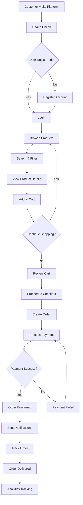
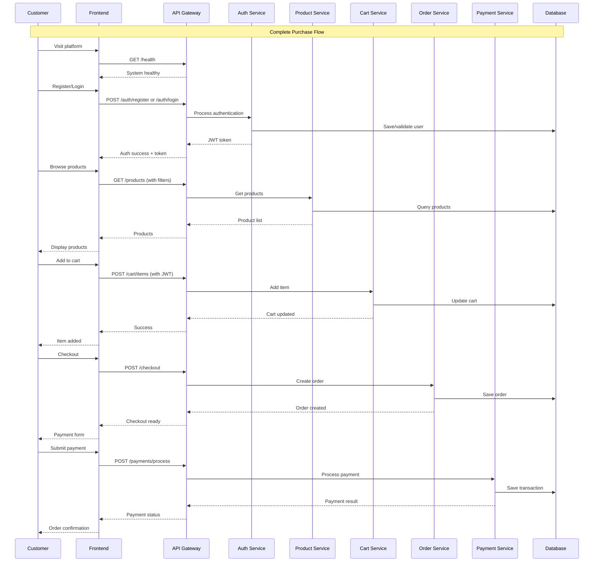

# Complete E-commerce Platform User Stories & Workflows

## Table of Contents
1. [Customer User Stories](#customer-user-stories)
2. [Admin User Stories](#admin-user-stories)
3. [Vendor User Stories](#vendor-user-stories)
4. [System User Stories](#system-user-stories)
5. [Complete Workflow Diagrams](#complete-workflow-diagrams)
6. [API Integration Flows](#api-integration-flows)

---

## Customer User Stories

### Epic 1: Account Management & Authentication

#### User Story 1.1: Account Registration
**As a** new customer  
**I want to** create an account on the e-commerce platform  
**So that** I can save my preferences, track orders, and have a personalized shopping experience

**Acceptance Criteria:**
- ✅ I can register with first name, last name, email, password, and phone number
- ✅ Password must meet security requirements (8+ chars, mixed case, numbers, special chars)
- ✅ Email format is validated
- ✅ I receive appropriate error messages for invalid inputs
- ✅ Duplicate email registrations are prevented
- ✅ I receive a welcome message upon successful registration

**API Workflow:**
```
1. GET /api/health → Verify system availability
2. POST /api/auth/register → Create new user account
   Input: {firstName, lastName, email, password, phone}
   Output: User profile + success message
```

**Test Scenarios:**
- Valid registration with all required fields
- Registration with invalid email format
- Registration with weak password
- Registration with existing email
- Registration with missing required fields

#### User Story 1.2: User Authentication
**As a** registered customer  
**I want to** log into my account securely  
**So that** I can access my personal data and make purchases

**Acceptance Criteria:**
- ✅ I can log in with email and password
- ✅ I receive a JWT token for authenticated sessions
- ✅ Token expires after a reasonable time for security
- ✅ I get clear error messages for invalid credentials
- ✅ My user profile is returned upon successful login

**API Workflow:**
```
1. POST /api/auth/login → Authenticate user
   Input: {email, password}
   Output: {accessToken, tokenType, expiresIn, user}
2. All subsequent requests include: Authorization: Bearer <token>
```

#### User Story 1.3: Profile Management
**As a** logged-in customer  
**I want to** view and manage my profile information  
**So that** I can keep my account details up to date

**Acceptance Criteria:**
- ✅ I can view my current profile information
- ✅ I can view other users' public profiles (by ID)
- ✅ Profile includes: name, email, phone, account status, creation date
- ✅ Sensitive information is protected and not exposed

**API Workflow:**
```
1. GET /api/users/profile → Get my profile
2. GET /api/users/{id} → View another user's profile
```

---

### Epic 2: Product Discovery & Search

#### User Story 2.1: Product Catalog Browsing
**As a** customer  
**I want to** browse the product catalog  
**So that** I can discover products I'm interested in purchasing

**Acceptance Criteria:**
- ✅ I can view all products with pagination
- ✅ I can filter products by category, featured status
- ✅ I can search products by name or description
- ✅ Each product shows: name, price, description, SKU, availability
- ✅ Products are displayed with proper formatting and images

**API Workflow:**
```
1. GET /api/products → Browse all products
   Query params: ?page=0&size=20&category=electronics&featured=true
2. GET /api/products/{id} → View specific product details
```

#### User Story 2.2: Advanced Product Search
**As a** customer  
**I want to** search for products with advanced filters  
**So that** I can quickly find exactly what I'm looking for

**Acceptance Criteria:**
- ✅ I can search by keyword/query string
- ✅ I can filter by category, price range (min/max)
- ✅ I can sort results by price, name, rating, popularity
- ✅ I can control sort direction (ascending/descending)
- ✅ Search results include total count and pagination
- ✅ Search performance is tracked and optimized

**API Workflow:**
```
1. GET /api/search/products → Advanced product search
   Query: ?query=gaming+laptop&category=electronics&minPrice=800&maxPrice=2000&sortBy=price&sortDirection=asc
2. GET /api/search/suggestions → Get search suggestions
   Query: ?query=lap&limit=5
```

#### User Story 2.3: Personalized Recommendations
**As a** customer  
**I want to** receive personalized product recommendations  
**So that** I can discover relevant products based on my interests and behavior

**Acceptance Criteria:**
- ✅ I receive recommendations based on my browsing history
- ✅ Recommendations include reasoning (why this product was suggested)
- ✅ I can limit the number of recommendations
- ✅ Recommendations are updated based on my interactions
- ✅ Each recommendation includes product details and confidence score

**API Workflow:**
```
1. GET /api/search/recommendations → Get personalized recommendations
   Query: ?limit=10
   Output: Products with recommendation scores and reasons
```

---

### Epic 3: Shopping Cart Management

#### User Story 3.1: Cart Operations
**As a** customer  
**I want to** manage items in my shopping cart  
**So that** I can collect products before making a purchase decision

**Acceptance Criteria:**
- ✅ I can view my current cart contents and total
- ✅ I can add products to my cart with specified quantities
- ✅ I can update quantities of items in my cart
- ✅ I can remove individual items from my cart
- ✅ I can clear my entire cart
- ✅ I can see my cart item count at any time
- ✅ Cart persists across sessions when logged in

**API Workflow:**
```
1. GET /api/cart → View current cart
2. POST /api/cart/items → Add item to cart
   Input: {productId, quantity}
3. PUT /api/cart/items/{itemId} → Update item quantity
4. DELETE /api/cart/items/{itemId} → Remove specific item
5. DELETE /api/cart → Clear entire cart
6. GET /api/cart/count → Get cart item count
```

#### User Story 3.2: Cart Persistence
**As a** customer  
**I want to** have my cart saved when I log out and return  
**So that** I don't lose my selected items between sessions

**Acceptance Criteria:**
- ✅ Cart contents are saved to my user account
- ✅ Cart is restored when I log back in
- ✅ Cart remains synchronized across different devices/browsers
- ✅ Cart has reasonable expiration for abandoned items

---

### Epic 4: Checkout & Order Management

#### User Story 4.1: Checkout Process
**As a** customer  
**I want to** proceed through a streamlined checkout process  
**So that** I can complete my purchase efficiently

**Acceptance Criteria:**
- ✅ I can initiate checkout from my cart
- ✅ I can review all items and pricing before payment
- ✅ I can provide shipping and billing addresses
- ✅ I can see calculated taxes and shipping costs
- ✅ Order is created and held pending payment confirmation

**API Workflow:**
```
1. POST /api/checkout → Initiate checkout workflow
2. POST /api/orders → Create order from cart
   Input: {user_id, items[], addresses, payment_method}
```

#### User Story 4.2: Order Tracking
**As a** customer  
**I want to** track my orders and view order history  
**So that** I can monitor my purchases and deliveries

**Acceptance Criteria:**
- ✅ I can view all my past orders with pagination
- ✅ I can view detailed information for each order
- ✅ I can track order status (PENDING → CONFIRMED → SHIPPED → DELIVERED)
- ✅ I can see order items, quantities, prices, and totals
- ✅ I can view order timeline and status changes
- ✅ I can cancel orders when appropriate

**API Workflow:**
```
1. GET /api/orders → View order history
   Query: ?page=0&size=10
2. GET /api/orders/{id} → View specific order details
3. PUT /api/orders/{id}/cancel → Cancel order (if eligible)
```

---

### Epic 5: Payment Processing

#### User Story 5.1: Payment Methods
**As a** customer  
**I want to** pay for my orders using various payment methods  
**So that** I can complete purchases conveniently and securely

**Acceptance Criteria:**
- ✅ I can pay with credit/debit cards
- ✅ Payment processing is secure and PCI compliant
- ✅ I receive immediate feedback on payment success/failure
- ✅ Failed payments allow me to retry with different methods
- ✅ Payment confirmations are sent via email

**API Workflow:**
```
1. POST /api/payments/process → Process payment
   Input: {orderId, amount, currency, paymentMethod, paymentDetails}
2. GET /api/payments/{id} → Check payment status
3. Integration with Stripe: POST /api/stripe/process-payment
```

#### User Story 5.2: Payment History
**As a** customer  
**I want to** view my payment history and transaction details  
**So that** I can track my spending and maintain financial records

**Acceptance Criteria:**
- ✅ I can view all my payment transactions
- ✅ Each transaction shows amount, date, status, and order reference
- ✅ I can download receipts and invoices
- ✅ Refund information is clearly displayed

---

### Epic 6: Notifications & Communication

#### User Story 6.1: Order Notifications
**As a** customer  
**I want to** receive notifications about my order status changes  
**So that** I'm always informed about my purchases

**Acceptance Criteria:**
- ✅ I receive notifications when orders are confirmed, shipped, delivered
- ✅ I can view notifications in the app
- ✅ I can mark notifications as read
- ✅ I can see my unread notification count
- ✅ Notifications include relevant order details and timestamps

**API Workflow:**
```
1. GET /api/notifications → View all notifications
   Query: ?unreadOnly=true&page=0&size=20
2. PUT /api/notifications/{id}/read → Mark notification as read
3. GET /api/notifications/unread/count → Get unread count
```

---

### Epic 7: User Analytics & Behavior Tracking

#### User Story 7.1: Shopping Behavior Analytics
**As a** customer using the platform  
**My shopping behavior should be** tracked anonymously  
**So that** I receive better recommendations and the platform improves

**Acceptance Criteria:**
- ✅ Product views are tracked for recommendations
- ✅ Search queries are analyzed for search improvements
- ✅ Cart actions are tracked for conversion optimization
- ✅ Page views are tracked for user experience analysis
- ✅ Privacy is maintained and data is used ethically

**API Workflow:**
```
1. POST /api/analytics/track → Track user events
   Input: {eventType, productId, category, metadata}
   Events: PRODUCT_VIEW, SEARCH, CART_ADD, CART_REMOVE, CHECKOUT_START, PURCHASE_COMPLETE
2. POST /api/analytics/track/page-view → Track page visits
```

---

## Admin User Stories

### Epic 8: Administrative Dashboard

#### User Story 8.1: Business Analytics Dashboard
**As an** admin  
**I want to** view comprehensive business analytics  
**So that** I can make informed decisions about the platform

**Acceptance Criteria:**
- ✅ I can view total revenue, orders, and user counts
- ✅ I can see conversion rates and average order values
- ✅ I can analyze top-performing products
- ✅ I can view sales trends over time
- ✅ I can filter analytics by date ranges
- ✅ Data is presented in clear, visual formats

**API Workflow:**
```
1. GET /api/analytics/admin/dashboard → Comprehensive dashboard
   Query: ?startDate=2025-01-01&endDate=2025-01-31
   Output: {totalRevenue, totalOrders, totalUsers, conversionRate, topProducts, salesByDay}
```

#### User Story 8.2: Product Management
**As an** admin  
**I want to** manage the product catalog  
**So that** I can maintain accurate and up-to-date product information

**Acceptance Criteria:**
- ✅ I can create new products with all details
- ✅ I can update existing product information
- ✅ I can activate/deactivate products
- ✅ I can set featured products
- ✅ I can manage product pricing and inventory

**API Workflow:**
```
1. POST /api/products → Create new product (Admin only)
2. PUT /api/products/{id} → Update product (Admin only)
3. DELETE /api/products/{id} → Delete product (Admin only)
```

#### User Story 8.3: Notification Management
**As an** admin  
**I want to** send notifications to users  
**So that** I can communicate important information and updates

**Acceptance Criteria:**
- ✅ I can send notifications to specific users
- ✅ I can send broadcast notifications to all users
- ✅ I can choose notification types and priorities
- ✅ I can track notification delivery and read status

**API Workflow:**
```
1. POST /api/notifications/admin/send → Send notification to user
2. POST /api/notifications/admin/broadcast → Send to all users
```

---

## Vendor User Stories

### Epic 9: Vendor Management

#### User Story 9.1: Vendor Registration & Management
**As a** vendor  
**I want to** register and manage my vendor account  
**So that** I can sell products on the platform

**Acceptance Criteria:**
- ✅ I can register as a vendor with business details
- ✅ I can manage my vendor profile and contact information
- ✅ I can view my vendor dashboard with sales metrics
- ✅ My vendor status and verification can be managed

**API Workflow:**
```
1. POST /api/vendors → Register new vendor
2. GET /api/vendors/{id} → View vendor details
3. PUT /api/vendors/{id} → Update vendor information
```

### Epic 10: Inventory Management

#### User Story 10.1: Inventory Tracking
**As a** vendor  
**I want to** manage my product inventory  
**So that** I can track stock levels and avoid overselling

**Acceptance Criteria:**
- ✅ I can view current inventory levels for my products
- ✅ I can update stock quantities
- ✅ I can set low stock alerts
- ✅ Inventory is automatically updated when orders are placed
- ✅ I can track inventory movements and history

**API Workflow:**
```
1. GET /api/inventory → View inventory levels
2. PUT /api/inventory/{productId} → Update stock quantity
3. GET /api/inventory/alerts → View low stock alerts
```

---

## System User Stories

### Epic 11: System Health & Monitoring

#### User Story 11.1: System Health Monitoring
**As a** system administrator  
**I want to** monitor the health of all system components  
**So that** I can ensure reliable service for users

**Acceptance Criteria:**
- ✅ Health check endpoint provides system status
- ✅ All critical services are monitored
- ✅ Response times are tracked and optimized
- ✅ System uptime and availability are measured

**API Workflow:**
```
1. GET /api/health → System health status
   Output: {status: "UP", message, timestamp}
```

#### User Story 11.2: Search Infrastructure
**As a** system  
**I want to** provide fast and accurate search capabilities  
**So that** users can quickly find products they're looking for

**Acceptance Criteria:**
- ✅ Elasticsearch integration for advanced search
- ✅ Search indexing and optimization
- ✅ Auto-complete and suggestions
- ✅ Search analytics and performance tracking

**API Workflow:**
```
1. GET /api/elasticsearch/admin/indices → Manage search indices (Admin)
2. POST /api/elasticsearch/admin/reindex → Rebuild search index (Admin)
```

---

## Complete Workflow Diagrams

### Customer Purchase Journey Flow


### API Request Flow Sequence


---

## API Integration Flows

### Authentication Flow
```
1. Registration Flow:
   POST /api/auth/register → 201 Created + User Profile
   
2. Login Flow:
   POST /api/auth/login → 200 OK + JWT Token + User Profile
   
3. Protected Resource Access:
   GET /api/users/profile (with Authorization: Bearer <token>)
```

### Product Discovery Flow
```
1. Browse Products:
   GET /api/products?page=0&size=20&featured=true
   
2. Search Products:
   GET /api/search/products?query=laptop&category=electronics
   
3. Get Recommendations:
   GET /api/search/recommendations?limit=10
   
4. Track Product View:
   POST /api/analytics/track {eventType: "PRODUCT_VIEW", productId: 1}
```

### Shopping & Checkout Flow
```
1. Cart Management:
   GET /api/cart → View cart
   POST /api/cart/items → Add item {productId, quantity}
   PUT /api/cart/items/{id} → Update quantity
   DELETE /api/cart/items/{id} → Remove item
   
2. Checkout Process:
   POST /api/checkout → Initiate checkout
   POST /api/orders → Create order
   POST /api/payments/process → Process payment
   
3. Order Tracking:
   GET /api/orders → Order history
   GET /api/orders/{id} → Order details
   GET /api/notifications → Order notifications
```

---

## Success Metrics & KPIs

### Customer Experience Metrics
- **Registration Conversion Rate**: % of visitors who create accounts
- **Search Success Rate**: % of searches resulting in product views
- **Cart Conversion Rate**: % of cart additions leading to purchases
- **Checkout Completion Rate**: % of checkouts resulting in successful orders
- **Payment Success Rate**: % of payment attempts that succeed
- **Customer Satisfaction**: Based on order completion and return rates

### System Performance Metrics
- **API Response Time**: Average response time < 200ms
- **Search Performance**: Search results returned < 100ms
- **System Uptime**: 99.9% availability target
- **Error Rate**: < 0.1% of requests result in errors

### Business Metrics
- **Average Order Value (AOV)**: Average amount per order
- **Customer Lifetime Value (CLV)**: Total value per customer
- **Revenue Growth**: Month-over-month revenue increase
- **Product Performance**: Top-selling products and categories
- **Inventory Turnover**: Rate of inventory movement

---

## Quality Assurance & Testing

### Test Coverage Areas
1. **Unit Tests**: Individual service and component testing
2. **Integration Tests**: API endpoint and service integration testing
3. **End-to-End Tests**: Complete user journey testing
4. **Performance Tests**: Load testing and response time validation
5. **Security Tests**: Authentication, authorization, and data protection testing

### Automated Test Scenarios
- User registration and authentication flows
- Product search and filtering functionality
- Cart operations and persistence
- Order creation and payment processing
- Notification delivery and management
- Analytics tracking and reporting

---

This comprehensive user story document covers all aspects of the e-commerce platform, from basic customer interactions to advanced administrative functions, ensuring complete feature coverage and clear workflow understanding for development, testing, and stakeholder communication.
