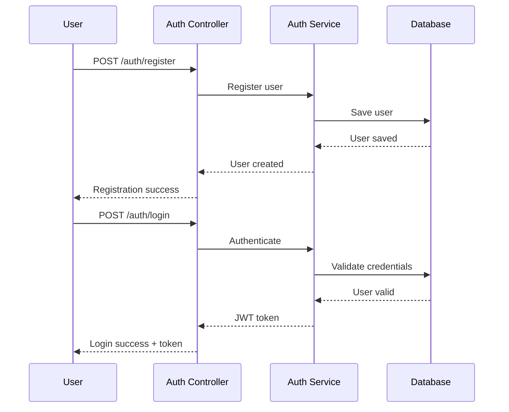
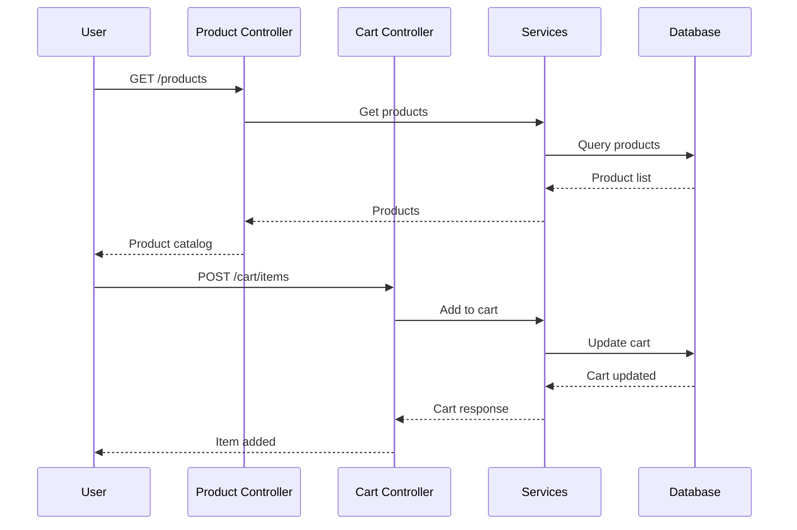
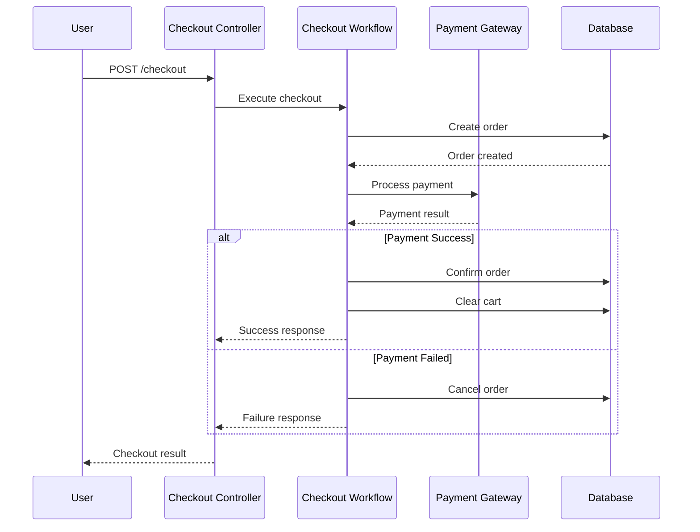

# E-Commerce Backend Application

A comprehensive e-commerce backend application built with **Clean Architecture** principles using **Spring Boot 3.5.3** and **Java 17**. This application provides a complete e-commerce solution with user management, product catalog, shopping cart, order processing, payment integration, and analytics.

## 🏗️ Architecture Overview

This application follows **Clean Architecture** principles with clear separation of concerns:

```
src/
├── main/java/com/ecommerce/
│   ├── core/                    # Business Logic Layer
│   │   ├── domain/             # Domain Entities & Business Rules
│   │   │   ├── cart/           # Cart domain
│   │   │   ├── order/          # Order domain
│   │   │   ├── payment/        # Payment domain
│   │   │   ├── product/        # Product domain
│   │   │   └── user/           # User domain
│   │   └── usecase/            # Application Use Cases
│   │       ├── cart/           # Cart operations
│   │       ├── checkout/       # Checkout workflow
│   │       ├── order/          # Order management
│   │       ├── payment/        # Payment processing
│   │       └── product/        # Product operations
│   ├── adapter/                # Interface Adapters Layer
│   │   ├── persistence/        # Database adapters
│   │   │   ├── entity/         # JPA entities
│   │   │   ├── mapper/         # Domain-Entity mappers
│   │   │   └── implementation/ # Repository implementations
│   │   └── web/                # Web controllers & DTOs
│   │       ├── controller/     # REST controllers
│   │       └── dto/            # Request/Response DTOs
│   ├── infrastructure/         # Infrastructure Layer
│   │   ├── config/             # Configuration classes
│   │   ├── external/           # External service integrations
│   │   └── service/            # Infrastructure services
│   └── shared/                 # Shared utilities
└── resources/
    ├── db/migration/           # Database migrations
    └── application*.yml        # Configuration files
```

## 🚀 Features

### Core Features
- ✅ **User Management**: Registration, authentication, profile management
- ✅ **Product Catalog**: Product management, categories, inventory tracking
- ✅ **Shopping Cart**: Cart management and persistence
- ✅ **Order Processing**: Order creation, status tracking, invoicing
- ✅ **Payment Integration**: Stripe integration, transaction management
- ✅ **Search & Recommendations**: Product search, personalized recommendations
- ✅ **Notifications**: Email, SMS, push notifications
- ✅ **Analytics**: User behavior tracking, reporting

### Technical Features
- **Clean Architecture** with clear separation of concerns
- **JWT Authentication** with role-based access control
- **RESTful API** with comprehensive documentation
- **Database Migrations** with Flyway
- **Payment Gateway Integration** (Stripe)
- **Email Service** with template support
- **Comprehensive Error Handling**
- **Input Validation** with Bean Validation
- **Audit Logging** with JPA Auditing

## 🛠️ Technology Stack

### Backend
- **Java 17** - Programming language
- **Spring Boot 3.5.3** - Application framework
- **Spring Security** - Authentication & authorization
- **Spring Data JPA** - Data persistence
- **Spring Mail** - Email service
- **JWT (JSON Web Tokens)** - Authentication tokens

### Database
- **PostgreSQL** - Production database
- **H2** - Development/testing database
- **Flyway** - Database migrations

### External Services
- **Stripe** - Payment processing
- **Elasticsearch** - Search functionality (optional)
- **SMTP** - Email delivery

### Development Tools
- **Maven** - Build tool
- **Lombok** - Code generation
- **MapStruct** - Object mapping
- **Docker** - Containerization

## 📋 Prerequisites

- **Java 17** or higher
- **Maven 3.6+**
- **PostgreSQL 12+** (for production)
- **Docker** (optional, for Elasticsearch)

## 🚀 Quick Start

### 1. Clone the Repository
```bash
git clone <repository-url>
cd e-commerce-backend
```

### 2. Configure Environment Variables
Create a `.env` file in the root directory:
```properties
# Database Configuration
DB_URL=jdbc:postgresql://localhost:5432/ecommerce
DB_USERNAME=your_db_username
DB_PASSWORD=your_db_password

# JWT Configuration
JWT_SECRET=your_jwt_secret_key_here_minimum_256_bits
JWT_EXPIRATION=86400000

# Stripe Configuration
STRIPE_PUBLIC_KEY=pk_test_your_stripe_public_key_here
STRIPE_SECRET_KEY=sk_test_your_stripe_secret_key_here
STRIPE_WEBHOOK_SECRET=whsec_your_webhook_secret_here

# Email Configuration
MAIL_USERNAME=your-email@gmail.com
MAIL_PASSWORD=your-app-password
```

### 3. Start External Services (Optional)
```bash
# Start Elasticsearch (optional)
docker-compose up -d elasticsearch
```

### 4. Run the Application
```bash
# Development mode (uses H2 database)
mvn spring-boot:run

# Production mode (uses PostgreSQL)
mvn spring-boot:run -Dspring.profiles.active=prod
```

The application will start on `http://localhost:8081`

### 5. Access H2 Console (Development)
- URL: `http://localhost:8081/h2-console`
- JDBC URL: `jdbc:h2:mem:testdb`
- Username: `sa`
- Password: (empty)

## 📚 API Documentation

### Base URL
```
http://localhost:8081/api
```

### Authentication
Include JWT token in the Authorization header:
```
Authorization: Bearer <your-jwt-token>
```

### Core Endpoints

#### Authentication
```http
POST /api/auth/register    # User registration
POST /api/auth/login       # User login
```

#### Products
```http
GET    /api/products              # Get all products
GET    /api/products/{id}         # Get product by ID
GET    /api/products/featured     # Get featured products
POST   /api/products              # Create product (Admin)
PUT    /api/products/{id}         # Update product (Admin)
DELETE /api/products/{id}         # Delete product (Admin)
```

#### Shopping Cart
```http
GET    /api/cart                  # Get user's cart
POST   /api/cart/items           # Add item to cart
PUT    /api/cart/items/{id}      # Update cart item
DELETE /api/cart/items/{id}      # Remove cart item
DELETE /api/cart                 # Clear cart
```

#### Orders
```http
GET    /api/orders               # Get user's orders
GET    /api/orders/{id}          # Get order by ID
POST   /api/orders               # Create order
PUT    /api/orders/{id}/cancel   # Cancel order
```

#### Payments
```http
POST   /api/payments/process     # Process payment
GET    /api/payments/{id}        # Get payment details
POST   /api/payments/refund      # Refund payment
```

#### Checkout
```http
POST   /api/checkout             # Complete checkout workflow
```

For complete API documentation, see [E-commerce API Documentation.md](E-commerce%20API%20Documentation.md)

## 🔄 Application Flow

### 1. User Registration & Authentication


### 2. Product Browsing & Cart Management


### 3. Checkout & Payment Process


## 🏛️ Domain Models

### Core Entities

#### User
```java
public class User {
    private Long id;
    private String firstName;
    private String lastName;
    private String email;
    private String password;
    private String phone;
    private boolean isActive;
    private boolean isEmailVerified;
    private LocalDateTime createdAt;
    private LocalDateTime updatedAt;
}
```

#### Product
```java
public class Product {
    private Long id;
    private String name;
    private String slug;
    private String description;
    private String sku;
    private BigDecimal basePrice;
    private BigDecimal salePrice;
    private String currency;
    private boolean isActive;
    private boolean isFeatured;
    private LocalDateTime createdAt;
    private LocalDateTime updatedAt;
}
```

#### Order
```java
public class Order {
    private Long id;
    private String orderNumber;
    private Long userId;
    private OrderStatus status;
    private BigDecimal subtotalAmount;
    private BigDecimal taxAmount;
    private BigDecimal shippingAmount;
    private BigDecimal discountAmount;
    private BigDecimal totalAmount;
    private String currency;
    private List<OrderItem> items;
    private Address shippingAddress;
    private Address billingAddress;
    private LocalDateTime createdAt;
    private LocalDateTime updatedAt;
}
```

#### Payment
```java
public class Payment {
    private Long id;
    private String paymentId;
    private Long orderId;
    private Long userId;
    private BigDecimal amount;
    private String currency;
    private PaymentMethod paymentMethod;
    private PaymentStatus status;
    private String transactionId;
    private LocalDateTime createdAt;
    private LocalDateTime updatedAt;
}
```

## 🔧 Configuration

### Application Profiles

#### Development (`application-dev.yml`)
- Uses H2 in-memory database
- Disabled email/SMS services
- Debug logging enabled
- Mock payment gateway

#### Production (`application-prod.yml`)
- Uses PostgreSQL database
- Real email/SMS services
- Optimized logging
- Real payment gateway integration

#### Test (`application-test.yml`)
- Uses H2 for testing
- Disabled external services
- Fast test execution

### Environment Variables

| Variable | Description | Default |
|----------|-------------|---------|
| `DB_URL` | Database URL | `jdbc:h2:mem:testdb` |
| `DB_USERNAME` | Database username | `sa` |
| `DB_PASSWORD` | Database password | (empty) |
| `JWT_SECRET` | JWT signing secret | (generated) |
| `JWT_EXPIRATION` | JWT expiration time | `86400000` (24h) |
| `STRIPE_SECRET_KEY` | Stripe secret key | (required for payments) |
| `MAIL_USERNAME` | SMTP username | (required for emails) |
| `MAIL_PASSWORD` | SMTP password | (required for emails) |

## 🧪 Testing

### Running Tests
```bash
# Run all tests
mvn test

# Run specific test class
mvn test -Dtest=UserServiceTest

# Run integration tests
mvn test -Dtest=*IntegrationTest

# Run with specific profile
mvn test -Dspring.profiles.active=test
```

### Test Categories

#### Unit Tests
- Domain entity tests
- Use case tests
- Service tests
- Utility tests

#### Integration Tests
- Repository tests
- Controller tests
- End-to-end workflow tests

#### API Tests
- REST endpoint tests
- Authentication tests
- Validation tests

### Sample Test Cases

#### User Registration Test
```bash
curl -X POST http://localhost:8081/api/auth/register \
  -H "Content-Type: application/json" \
  -d '{
    "firstName": "John",
    "lastName": "Doe",
    "email": "john.doe@example.com",
    "password": "SecurePass123!",
    "phone": "+1234567890"
  }'
```

#### Product Search Test
```bash
curl -X GET "http://localhost:8081/api/products?search=laptop&featured=true&page=0&size=10"
```

#### Checkout Test
```bash
curl -X POST http://localhost:8081/api/checkout \
  -H "Authorization: Bearer <jwt-token>" \
  -H "Content-Type: application/json" \
  -d '{
    "userId": 1,
    "paymentMethod": "CREDIT_CARD",
    "paymentMethodId": "pm_card_visa",
    "customerId": "cus_customer123",
    "shippingAddress": {
      "street": "123 Main St",
      "city": "New York",
      "state": "NY",
      "zipCode": "10001",
      "country": "US"
    },
    "billingAddress": {
      "street": "123 Main St",
      "city": "New York",
      "state": "NY",
      "zipCode": "10001",
      "country": "US"
    }
  }'
```

## 🚀 Deployment

### Local Development
```bash
# Start with development profile
mvn spring-boot:run -Dspring.profiles.active=dev
```

### Production Deployment
```bash
# Build the application
mvn clean package -DskipTests

# Run with production profile
java -jar target/E-commerce-0.0.1-SNAPSHOT.jar --spring.profiles.active=prod
```

### Docker Deployment
```bash
# Build Docker image
docker build -t ecommerce-backend .

# Run container
docker run -p 8081:8081 \
  -e SPRING_PROFILES_ACTIVE=prod \
  -e DB_URL=jdbc:postgresql://host.docker.internal:5432/ecommerce \
  -e DB_USERNAME=postgres \
  -e DB_PASSWORD=password \
  ecommerce-backend
```

### Environment Setup Checklist

#### Development
- [ ] Java 17 installed
- [ ] Maven 3.6+ installed
- [ ] IDE configured (IntelliJ IDEA/Eclipse)
- [ ] H2 console accessible

#### Production
- [ ] PostgreSQL database setup
- [ ] Environment variables configured
- [ ] SSL certificates installed
- [ ] Stripe account configured
- [ ] SMTP server configured
- [ ] Monitoring tools setup

## 📊 Monitoring & Observability

### Health Checks
```bash
# Application health
curl http://localhost:8081/api/health

# Database health
curl http://localhost:8081/actuator/health/db
```

### Metrics
- Application metrics via Spring Boot Actuator
- Custom business metrics
- Database performance metrics
- Payment gateway metrics

### Logging
- Structured logging with JSON format
- Different log levels per environment
- Audit logging for sensitive operations
- Error tracking and alerting

## 🔒 Security

### Authentication & Authorization
- JWT-based authentication
- Role-based access control (RBAC)
- Password encryption with BCrypt
- Session management

### Data Protection
- Input validation and sanitization
- SQL injection prevention
- XSS protection
- CSRF protection
- Rate limiting

### Payment Security
- PCI DSS compliance considerations
- Secure payment token handling
- Webhook signature verification
- Sensitive data encryption

## 🤝 Contributing

### Development Workflow
1. Fork the repository
2. Create a feature branch
3. Make your changes
4. Add tests for new functionality
5. Ensure all tests pass
6. Submit a pull request

### Code Standards
- Follow Java coding conventions
- Use meaningful variable and method names
- Write comprehensive tests
- Document public APIs
- Follow Clean Architecture principles

### Commit Message Format
```
type(scope): description

[optional body]

[optional footer]
```

Example:
```
feat(payment): add Stripe webhook handling

- Add webhook endpoint for payment confirmations
- Implement signature verification
- Add error handling and logging

Closes #123
```

## 📝 License

This project is licensed under the MIT License - see the [LICENSE](LICENSE) file for details.

## 🆘 Support

### Documentation
- [API Documentation](E-commerce%20API%20Documentation.md)
- [Architecture Guide](docs/architecture.md)
- [Deployment Guide](docs/deployment.md)

### Getting Help
- Create an issue for bugs or feature requests
- Check existing issues for solutions
- Review the documentation
- Contact the development team

### Troubleshooting

#### Common Issues

**Application won't start**
- Check Java version (requires Java 17+)
- Verify database connection
- Check environment variables
- Review application logs

**Database connection errors**
- Verify database is running
- Check connection string
- Validate credentials
- Ensure database exists

**Payment processing fails**
- Verify Stripe configuration
- Check API keys
- Review webhook setup
- Monitor Stripe dashboard

**Email notifications not working**
- Verify SMTP configuration
- Check email credentials
- Test email connectivity
- Review email templates

## 🗺️ Roadmap

### Phase 1 (Current)
- [x] Core e-commerce functionality
- [x] User management
- [x] Product catalog
- [x] Shopping cart
- [x] Order processing
- [x] Payment integration

### Phase 2 (Current)
- [x] Advanced search with Elasticsearch
- [x] Real-time notifications
- [x] Inventory management
- [x] Multi-vendor support
- [x] Advanced analytics dashboard

### Phase 3 (Future)
- [ ] Mobile app API
- [ ] Microservices architecture
- [ ] Event-driven architecture
- [ ] Machine learning recommendations
- [ ] International payment methods

---

## 📞 Contact

For questions, suggestions, or support, please contact the development team or create an issue in the repository.

**Happy coding! 🚀**