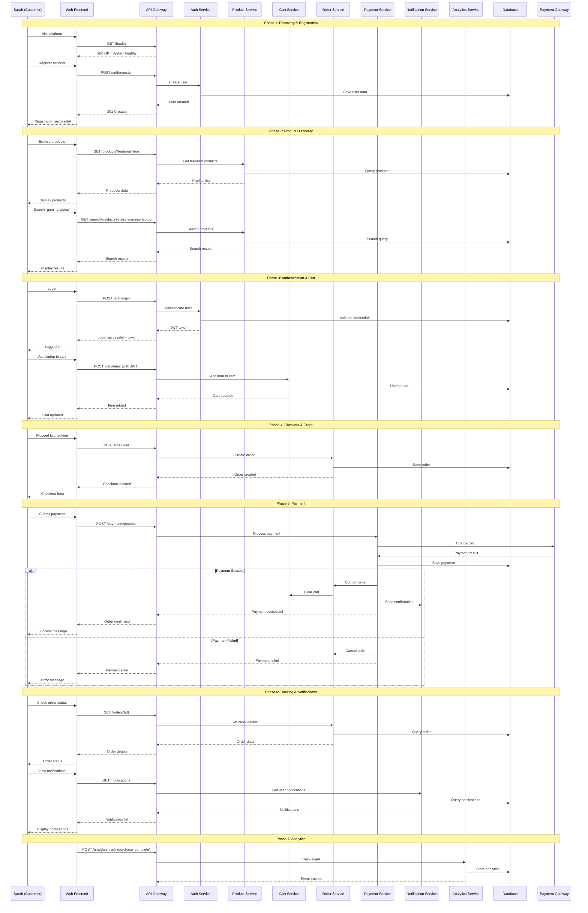

# User Story: Complete E-commerce Customer Journey

**As a customer named Sarah, I want to discover, purchase, and track products through a seamless e-commerce experience, so that I can efficiently buy what I need with confidence and convenience.**

---

## Workflow: End-to-End Customer Journey

---

### Phase 1: Discovery & Registration
**Story:** Sarah discovers the e-commerce platform and creates an account

#### Workflow Steps:

**Landing & Health Check**
- Sarah visits the platform
- System performs health check to ensure all services are operational
- Platform loads successfully with product catalog

**User Registration**
- Sarah clicks "Sign Up"
- Fills registration form with personal details
- System validates input and creates account
- Email verification sent (optional)

**API Flow:**
```http
GET /api/health → 200 OK
POST /api/auth/register → 201 Created
```

---

### Phase 2: Product Discovery & Search
**Story:** Sarah browses and searches for products she needs

#### Workflow Steps:

**Browse Product Catalog**
- Sarah views featured products on homepage
- Browses products by categories
- Views product details and specifications

**Advanced Search**
- Sarah searches for "gaming laptop"
- Applies filters (price range, brand, features)
- Sorts results by price or ratings
- Gets personalized recommendations

**Product Analytics Tracking**
- System tracks Sarah's browsing behavior
- Records product views and search queries
- Updates recommendation engine

**API Flow:**
```http
GET /api/products?featured=true → Product catalog
GET /api/search/products?query=gaming+laptop&minPrice=800&maxPrice=2000 → Search results
GET /api/search/recommendations → Personalized suggestions
POST /api/analytics/track → Track user behavior
```

---

### Phase 3: Authentication & Cart Management
**Story:** Sarah logs in and manages her shopping cart

#### Workflow Steps:

**User Login**
- Sarah enters email and password
- System authenticates and returns JWT token
- User session established

**Shopping Cart Operations**
- Sarah adds gaming laptop to cart (quantity: 1)
- Adds gaming mouse to cart (quantity: 2)
- Reviews cart contents and total price
- Updates quantities or removes items as needed

**API Flow:**
```http
POST /api/auth/login → JWT token + user profile
POST /api/cart/items → Add laptop to cart
POST /api/cart/items → Add mouse to cart
GET /api/cart → View cart contents
PUT /api/cart/items/{id} → Update quantities
```

---

### Phase 4: Checkout & Order Creation
**Story:** Sarah proceeds through checkout and creates an order

#### Workflow Steps:

**Checkout Initiation**
- Sarah clicks "Proceed to Checkout"
- Reviews cart items and pricing
- Enters shipping and billing addresses

**Order Creation**
- System creates order from cart contents
- Calculates taxes and shipping costs
- Generates order number and invoice
- Cart is temporarily held for payment

**API Flow:**
```http
POST /api/checkout → Initiate checkout workflow
POST /api/orders → Create order with items and addresses
```

---

### Phase 5: Payment Processing
**Story:** Sarah completes payment for her order

#### Workflow Steps:

**Payment Method Selection**
- Sarah chooses credit card payment
- Enters payment details securely
- Reviews final order total

**Payment Processing**
- System processes payment through Stripe gateway
- Payment validation and authorization
- Transaction confirmation or failure handling

**Order Confirmation**
- On successful payment: order confirmed, cart cleared
- On payment failure: order cancelled, cart restored
- Email confirmation sent to Sarah

**API Flow:**
```http
POST /api/payments/process → Process credit card payment
GET /api/payments/{id} → Verify payment status
GET /api/orders/{id} → Confirm order details
```

---

### Phase 6: Order Tracking & Notifications
**Story:** Sarah tracks her order and receives updates

#### Workflow Steps:

**Order Status Updates**
- Order status changes: PENDING → CONFIRMED → SHIPPED → DELIVERED
- Sarah receives notifications for each status change
- Real-time updates via WebSocket (if implemented)

**Notification Management**
- Sarah receives email notifications
- Views in-app notifications
- Marks notifications as read

**Order History**
- Sarah views her order history
- Downloads invoices and receipts
- Tracks shipping information

**API Flow:**
```http
GET /api/orders → View order history
GET /api/orders/{id} → Track specific order
GET /api/notifications → View notifications
PUT /api/notifications/{id}/read → Mark as read
```

---

### Phase 7: Post-Purchase Experience
**Story:** Sarah completes her purchase experience and provides feedback

#### Workflow Steps:

**Order Fulfillment**
- Sarah receives her products
- Verifies order contents and quality
- Updates order status to "DELIVERED"

**Analytics & Recommendations**
- System tracks purchase completion
- Updates customer behavior analytics
- Generates future product recommendations
- Improves search and recommendation algorithms

**API Flow:**
```http
POST /api/analytics/track → Track purchase completion
GET /api/search/recommendations → Updated recommendations
GET /api/analytics/admin/dashboard → Business analytics (admin view)
```

---

## Complete Workflow Sequence Diagram


---

## Key Business Metrics Tracked

**Customer Journey Metrics:**
- Registration conversion rate
- Product view to cart addition rate
- Cart abandonment rate
- Checkout completion rate
- Payment success rate
- Customer lifetime value

**System Performance Metrics:**
- API response times
- Search result relevance
- Recommendation click-through rate
- Notification delivery success
- Order fulfillment time

---

## Success Criteria

**For Sarah (Customer):**
- ✅ Easy account creation and login
- ✅ Intuitive product discovery and search
- ✅ Seamless cart management
- ✅ Secure and fast checkout process
- ✅ Reliable payment processing
- ✅ Real-time order tracking
- ✅ Timely notifications and updates

**For Business:**
- ✅ High conversion rates
- ✅ Low cart abandonment
- ✅ Secure payment processing
- ✅ Comprehensive analytics
- ✅ Scalable architecture
- ✅ Clean code maintainability

---

This user story demonstrates how your Clean Architecture e-commerce application handles a complete customer journey, showcasing all the implemented features from user management through analytics, while maintaining separation of concerns and following best practices.
